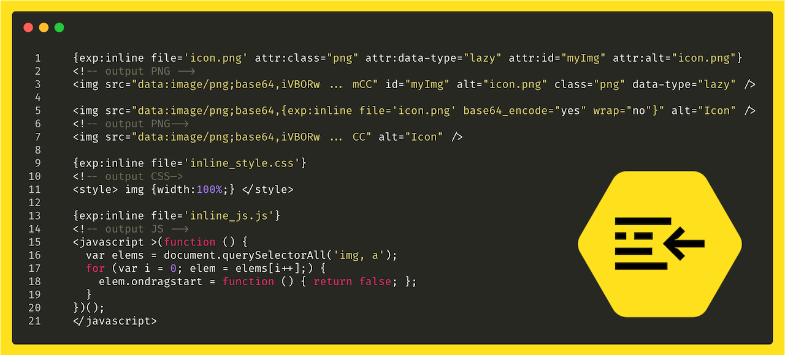

# MX Inline

**MX Inline** is an ExpressionEngine plugin that helps you inline files (like webp, png, jpeg, js, css, svg) into your templates.

## Installation
* Place the **mx_inline** folder inside your **user/addons** folder
* Go to **cp/addons** and install *MX Inline*.

## Template Tags

	{exp:inline file="file.png" base64_encode="no" wrap="yes" remote="no"}

### Parameters

*file*

Path to file (**full PATH!** not URL)

*base64_encode* _(optional, default = no)_

*wrap* _(optional, default = yes)_ 
Wrap file content into html tags based on file type.

*remote* _(optional, default = no)_
To include a remote file.

*cache* _(optional, default = yes)_

*refresh* _(optional, default = 1440)_

> Note: Refresh indicates the time, in minutes, between cache refreshes.

*type* _(optional, default = auto)_

Force file type: image, png, jpeg, js, css, svg.

####Adding attributes####
The plugin will add any attributes defined file tag output. 

	{exp:inline file='icon.png' attr:class="png" attr:data-type="lazy"  attr:alt="icon.png"}
	
	  <!-- output -->
	
	
	
## Examples

	  
	  <!-- output -->
	  
	  

### CSS ###

		{exp:inline file='inline_style.css'}
		<!-- output -->
		
		

### JS ###

	{exp:inline file='inline_js.js'}
	<!-- output -->
	
	<javascript >(function () {
	  var elems = document.querySelectorAll('img, a');
	  for (var i = 0; elem = elems[i++];) {
	    elem.ondragstart = function () { return false; };
	  }
	})();
	</javascript>
	
### SVG ###

	{exp:inline file='//example.com/demo_data/42.svg' attr:class="svg" remote="yes"}
	<!-- output -->
	
	<svg class="svg"  width="318" height="279" xmlns="http://www.w3.org/2000/svg" xmlns:xlink="http://www.w3.org/1999/xlink"> ... /svg>

## Warning

## Support Policy
This is Communite Edition add-on.

## Contributing To MX Inline for ExpressionEngine

Your participation to MX Inline development is very welcome!

You may participate in the following ways:

* [Report issues](https://github.com/MaxLazar/mx-inline/issues)
* Fix issues, develop features, write/polish documentation
Before you start, please adopt an existing issue (labelled with "ready for adoption") or start a new one to avoid duplicated efforts.
Please submit a merge request after you finish development.

### License

The MX Inline is open-sourced software licensed under the [MIT license](http://opensource.org/licenses/MIT)
